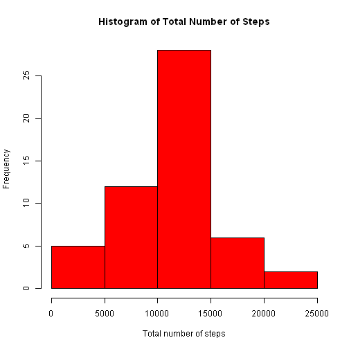
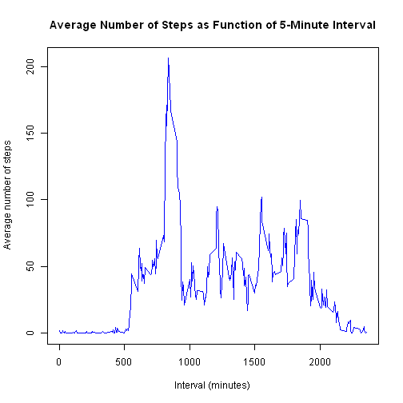
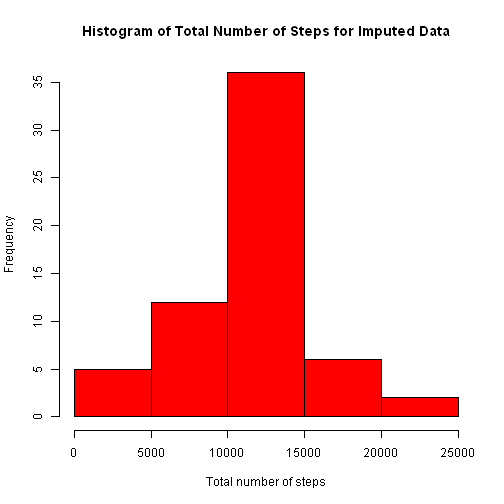
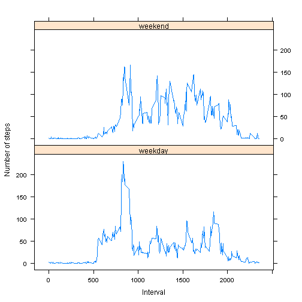

**Task:** Load and preprocess the data.  
**Solution:**


```r
unzip("activity.zip")
activityData <- read.csv("activity.csv", 
                         na.strings = "NA",
                         header = TRUE, 
                         colClasses = c("integer", "character", "integer"))
activityData$date <- as.Date(activityData$date, "%Y-%m-%d")
activityDataCC <- activityData[complete.cases(activityData), ]
```

**Task:** Calculate the total number of steps taken per day.  
**Solution:**


```r
totalSteps <- aggregate(data = activityDataCC, steps ~ date, FUN = sum)
```

**Task:** Make a histogram of the total number of steps taken each day.  
**Solution:**


```r
hist(totalSteps$steps, xlab = "Total number of steps",
     main = "Histogram of Total Number of Steps", col = "red")
```

 

**Task:** Calculate and report the mean and median of the total number of steps taken per day.  
**Solution:**


```r
print(paste("Mean of total number of steps taken per day is",
            round(mean(totalSteps$steps), 2), "steps."))
```

```
## [1] "Mean of total number of steps taken per day is 10766.19 steps."
```

```r
print(paste("Median of total number of steps taken per day is",
            round(median(totalSteps$steps), 2), "steps."))
```

```
## [1] "Median of total number of steps taken per day is 10765 steps."
```

**Task:** Make a time series plot (i.e. type = "l") of the 5-minute interval (x-axis) and the average number of steps taken, averaged across all days (y-axis).  
**Solution:**


```r
averageSteps <- aggregate(data = activityDataCC, steps ~ interval, mean)
plot(averageSteps$interval, averageSteps$steps, type = "l",
     xlab = "Interval (minutes)", ylab = "Average number of steps",
     main = "Average Number of Steps as Function of 5-Minute Interval", col = "blue")
```

 

**Task:** Which 5-minute interval, on average across all the days in the dataset, contains the maximum number of steps?  
**Solution:**


```r
print(paste("The 5-minute interval with the maximum number of steps,",
            "averaged across all days in the dataset, is ",
            averageSteps$interval[which.max(averageSteps$steps)],".", sep = ""))
```

```
## [1] "The 5-minute interval with the maximum number of steps,averaged across all days in the dataset, is 835."
```

**Task:** Calculate and report the total number of missing values in the dataset.  
**Solution:**


```r
print(paste("The total number of rows with missing values in the dataset is ",
            sum(is.na(activityData$steps)), ".", sep = ""))
```

```
## [1] "The total number of rows with missing values in the dataset is 2304."
```

**Task:** Devise a strategy for filling in all of the missing values in the dataset.  
**Solution:** My strategy will be to use the mean across days for the 5-minute interval.

**Task:** Create a new dataset that is equal to the original dataset but with the missing data filled in.  
**Solution:**


```r
impActivityData <- activityData
impActivityData$date <- as.Date(impActivityData$date, "%Y-%m-%d")
averageStepsVec <- with(impActivityData,
                        ave(steps, interval, FUN = function(x) mean(x, na.rm = TRUE)))
impActivityData$steps <- with(impActivityData,
                                  ifelse(is.na(steps), averageStepsVec, steps))
```

**Task:** Make a histogram of the total number of steps taken each day.  
**Solution:**


```r
impTotalSteps <- aggregate(data = impActivityData, steps ~ date, FUN = sum)
hist(impTotalSteps$steps, xlab = "Total number of steps",
     main = "Histogram of Total Number of Steps for Imputed Data",
     col = "red")
```

 

**Task:** Calculate and report the mean and median total number of steps taken per day.  
**Solution:**


```r
print(paste("Mean of total number of steps taken per day is",
            round(mean(impTotalSteps$steps), 2), "steps."))
```

```
## [1] "Mean of total number of steps taken per day is 10766.19 steps."
```

```r
print(paste("Median of total number of steps taken per day is",
            round(median(impTotalSteps$steps), 2), "steps."))
```

```
## [1] "Median of total number of steps taken per day is 10766.19 steps."
```

**Question:** Do these values differ from the estimates from the first part of the assignment?   
**Answer:** The mean remains the same at 10766.19 steps after imputation, which makes sense, as averaging a set with its average produces the same result. The median changes a bit from 10765 steps to 10766.19 steps.

**Question:** What is the impact of imputing missing data on the estimates of the total daily number of steps?  
**Answer:** The total daily number of steps increases, since NA values, counted before as zeros, were replaced by positive numbers.

**Task:** Create a new factor variable in the dataset with two levels - "weekday" and "weekend" indicating whether a given date is a weekday or weekend day.  
**Solution:**


```r
impActivityData$dayType <- 
    ifelse(weekdays(impActivityData$date) %in% c("Saturday", "Sunday"),
           "weekend", "weekday")
```

**Task:** Make a panel plot containing a time series plot (i.e. type = "l") of the 5-minute interval (x-axis) and the average number of steps taken, averaged across all weekday days or weekend days (y-axis).  
**Solution:**


```r
averageStepsDayType <- aggregate(data = impActivityData, steps ~ interval + dayType,
                                 mean)
library(lattice)
xyplot(steps ~ interval | dayType, data = averageStepsDayType, layout = c(1, 2),
       xlab = "Interval", ylab = "Number of steps", type = "l")
```

 
